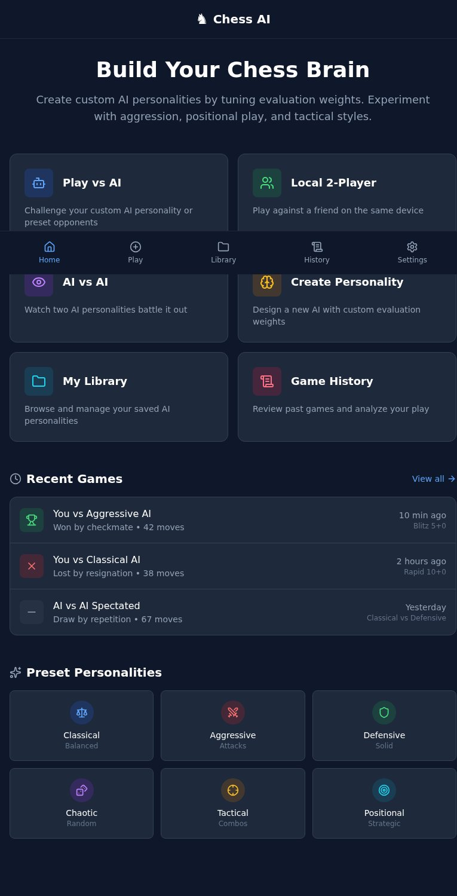
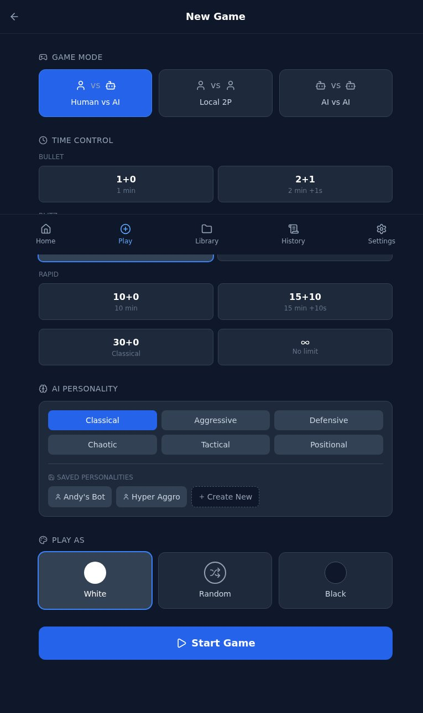
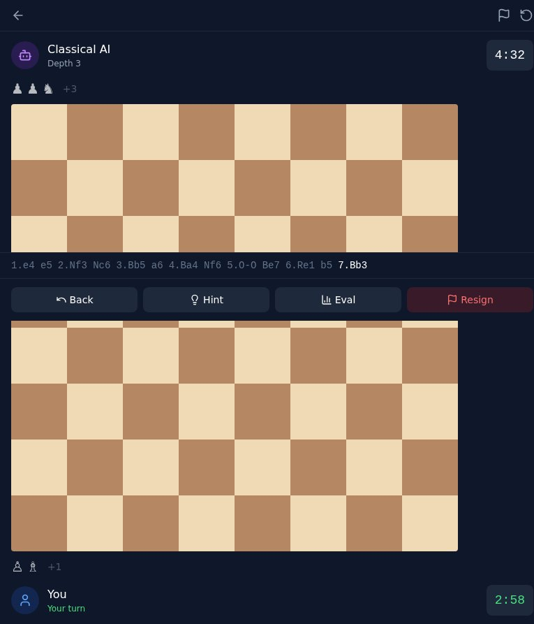
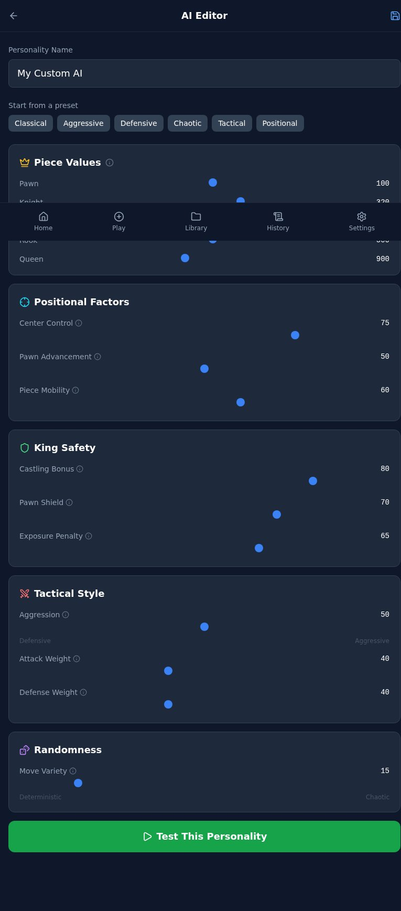
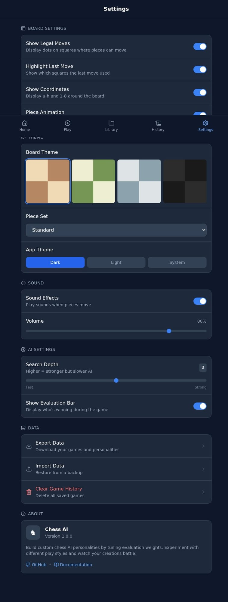

# Chess AI — Design Presentation

**Date:** February 26, 2026
**Designer:** Clawdbot (automated session)
**Status:** Ready for Review

---

## Executive Summary

A complete redesign of the Chess AI app implementing all feedback from Feb 26:

- ✅ **Multi-page architecture** — 8 distinct screens instead of single-page
- ✅ **Lucide icons throughout** — No emojis anywhere in UI
- ✅ **Tooltips for AI editor** — Every slider has explanatory hover text
- ✅ **Time controls** — Bullet, Blitz, Rapid, Classical, No Limit
- ✅ **Human vs Human mode** — Local 2-player option
- ✅ **Dark theme, Lichess quality** — Professional, modern, clean
- ✅ **Fully responsive** — Mobile-first with desktop enhancements

---

## Design Direction

### Style: "Modern Dark Chess"

Inspired by Lichess but with a more modern card-based layout. The design emphasizes:

1. **Clarity** — Clean hierarchy, obvious CTAs, minimal visual noise
2. **Focus on AI Editor** — The unique selling point gets premium UX treatment
3. **Speed** — Fast navigation via persistent bottom tabs (mobile) or top nav (desktop)
4. **Consistency** — Every screen uses the same component patterns

### Color Philosophy

- **Slate foundation** — Dark slate-900 background provides focus on content
- **Color coding** — Each section has an accent color for instant recognition:
  - Blue: Primary actions, navigation
  - Green: Success, wins, start game
  - Amber: Piece values, AI personality
  - Cyan: Positional factors
  - Purple: Randomness, AI vs AI
  - Red: Tactical, losses, destructive actions

---

## Screen-by-Screen Breakdown

### 1. Home (`01-home.html`)


**Purpose:** Landing page, quick actions hub, recent activity

**Key Features:**
- Hero section with clear value prop ("Build Your Chess Brain")
- 6 quick action cards (Play vs AI, Local 2P, AI vs AI, Create Personality, Library, History)
- Recent games list with win/loss/draw indicators
- Preset personality quick-select (6 presets)

**Design Notes:**
- Cards use color-coded icon backgrounds matching their category
- Recent games show time ago, time control, result — scannable at a glance

---

### 2. New Game (`02-new-game.html`)


**Purpose:** Game setup wizard

**Key Features:**
- **Game Mode** selector: Human vs AI / Local 2P / AI vs AI
- **Time Control** grid: Bullet (1+0, 2+1), Blitz (3+2, 5+0), Rapid (10+0, 15+10), Classical (30+0), No Limit
- **AI Personality** selection: 6 presets + saved personalities
- **Play As** selector: White / Random / Black

**Design Notes:**
- Time controls grouped by speed category with visual hierarchy
- Saved personalities show as chips with "Create New" option
- Large, tappable targets for mobile-friendly selection

---

### 3. Game Board (`03-game-board.html`)


**Purpose:** Active game view

**Key Features:**
- Full-width board (mobile) / board + sidebar (desktop)
- Player info cards with avatar, name, clock
- Move notation strip (scrollable)
- Action buttons: Back, Hint, Eval, Resign
- Material difference indicator

**Design Notes:**
- Minimal chrome during game — focus on the board
- Clocks are prominent and color-coded (active player highlighted)
- Quick actions accessible without leaving the board view
- Note: Chess pieces render via react-chessboard library (not shown in static mockup)

---

### 4. AI Editor (`04-ai-editor.html`)


**Purpose:** Create/edit AI personalities

**Key Features:**
- **Personality Name** input at top
- **Preset quick-select** row (start from existing personality)
- **5 collapsible sections**:
  1. Piece Values (Pawn, Knight, Bishop, Rook, Queen)
  2. Positional Factors (Center Control, Pawn Advancement, Piece Mobility)
  3. King Safety (Castling Bonus, Pawn Shield, Exposure Penalty)
  4. Tactical Style (Aggression, Attack Weight, Defense Weight)
  5. Randomness (Move Variety)
- **Tooltip on every slider** explaining what it does
- **Test This Personality** CTA button

**Design Notes:**
- Each section has a colored icon header for quick scanning
- Slider labels show semantic endpoints (e.g., "Defensive ↔ Aggressive")
- Info icons trigger tooltips with plain-English explanations
- This is the hero feature — given premium real estate and polish

---

### 5. Library (`05-library.html`)

**Purpose:** Browse and manage saved AI personalities

**Key Features:**
- Grid of personality cards (preset + saved)
- Each card shows: name, icon, brief description
- Actions: Play, Edit, Duplicate, Delete
- "Create New" prominent CTA

---

### 6. AI vs AI (`06-ai-vs-ai.html`)

**Purpose:** Spectator mode

**Key Features:**
- Two personality selectors (White AI, Black AI)
- Playback controls: Play, Pause, Step, Reset
- Speed slider (100ms – 2000ms between moves)
- Live board + move notation

---

### 7. History (`07-history.html`)

**Purpose:** Review past games

**Key Features:**
- Filterable list: All / Wins / Losses / Draws / AI vs AI
- Each row: Result icon, opponent name, time control, date, move count
- Tap to replay game

---

### 8. Settings (`08-settings.html`)


**Purpose:** User preferences

**Key Features:**
- **Board Settings:** Legal moves toggle, last move highlight, coordinates, animation
- **Theme:** Board theme (4 options), piece set, app theme (Dark/Light/System)
- **Sound:** Sound effects toggle, volume slider
- **AI Settings:** Search depth slider, evaluation bar toggle
- **Data:** Export, Import, Clear History
- **About:** Version, links to GitHub/docs

**Design Notes:**
- Comprehensive settings rival Lichess
- Toggle switches for boolean options, sliders for ranges
- Destructive action (Clear History) in red

---

## Responsive Behavior

### Mobile (< 1024px)
- **Navigation:** Bottom tab bar (5 tabs)
- **Layouts:** Single-column, stacked panels
- **Board:** Full-width, quick actions below
- **Touch targets:** Minimum 44px

### Desktop (≥ 1024px)
- **Navigation:** Top nav bar
- **Layouts:** Multi-column where appropriate
- **Board:** Sidebar with moves + evaluation
- **Hover states:** Tooltip reveals, card highlights

---

## Key Improvements from Feedback

| Feedback Item | Implementation |
|---------------|----------------|
| Multi-page app | 8 separate screens with proper navigation |
| Human vs Human | "Local 2-Player" game mode |
| Time controls | Full range: Bullet → Classical → No Limit |
| Icons over emojis | Lucide icons everywhere, zero emojis |
| Tooltips for AI editor | Every slider has an info icon with hover tooltip |
| Legal move toggle | Added to Settings → Board Settings |
| Dark theme, Lichess quality | Slate dark theme, clean typography, professional |
| Responsive | Mobile-first with desktop enhancements |

---

## Files Delivered

```
design/
├── STYLE-GUIDE.md         # Developer-ready style guide
├── PRESENTATION.md        # This file
├── screenshots/           # Visual previews
│   ├── 01-home.jpg
│   ├── 02-new-game.jpg
│   ├── 03-game-board.jpg
│   ├── 04-ai-editor.jpg
│   └── 08-settings.jpg
└── mockups/
    └── v2/                # Interactive HTML mockups
        ├── 00-design-system-v2.md
        ├── 01-home.html
        ├── 02-new-game.html
        ├── 03-game-board.html
        ├── 04-ai-editor.html
        ├── 05-library.html
        ├── 06-ai-vs-ai.html
        ├── 07-history.html
        ├── 08-settings.html
        └── README.md
```

---

## How to Preview Mockups

Open any HTML file directly in a browser:
```bash
open projects/chess-ai/design/mockups/v2/01-home.html
```

Or use a local server for live reload:
```bash
cd projects/chess-ai/design/mockups/v2
npx serve .
```

All dependencies (Tailwind, Lucide) load via CDN — no build required.

---

## Next Steps

1. **John reviews this presentation**
2. **Approve or request changes** to the design
3. **Implementation begins** — worker converts mockups to React components

---

## Questions for John

1. **Board themes:** The 4 options shown — want more? Custom colors?
2. **Piece sets:** Standard only, or add options (Alpha, Merida, etc.)?
3. **Sound effects:** Do we need these for MVP, or post-MVP?
4. **AI export:** Still planned for post-MVP? (Might affect Library UI)

---

**Ready for review.** Reply with approval or feedback.
