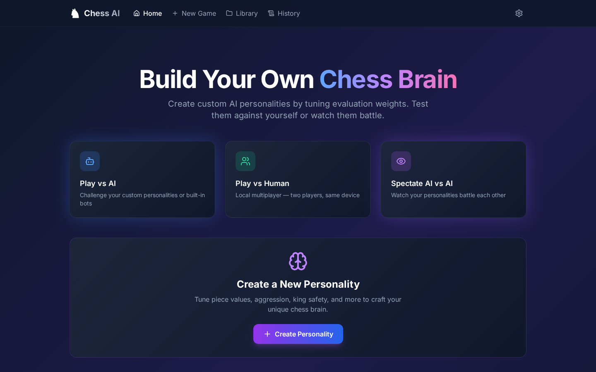
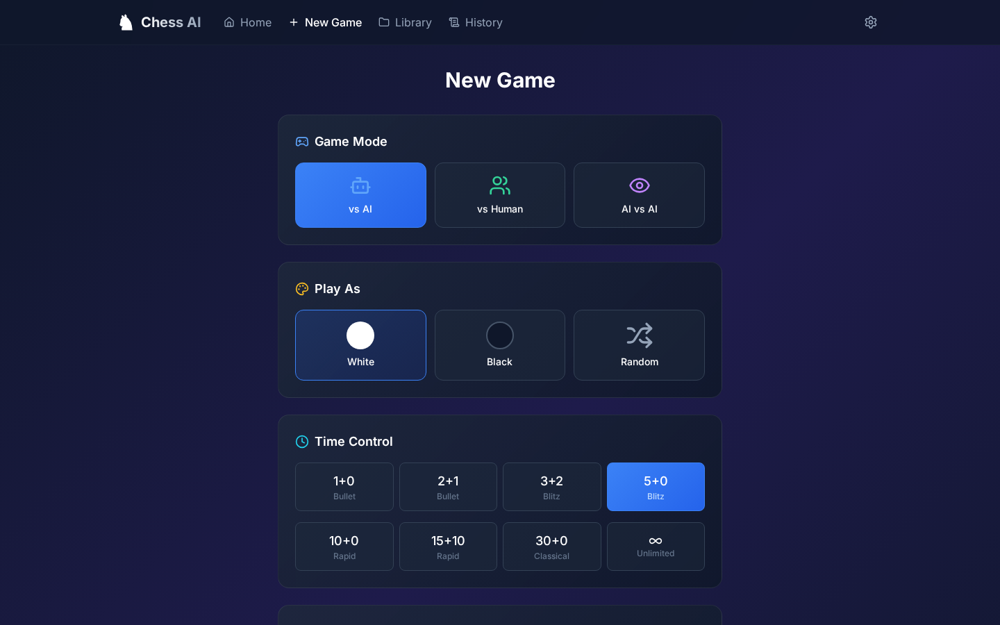
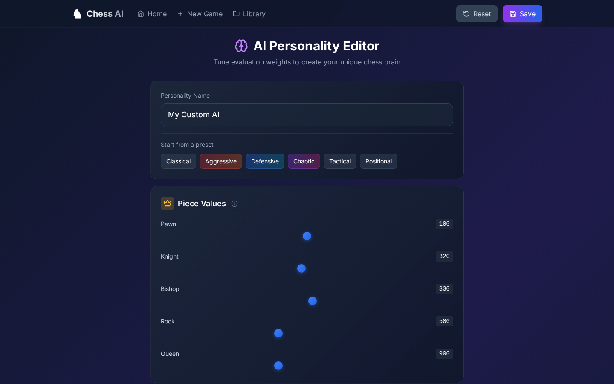
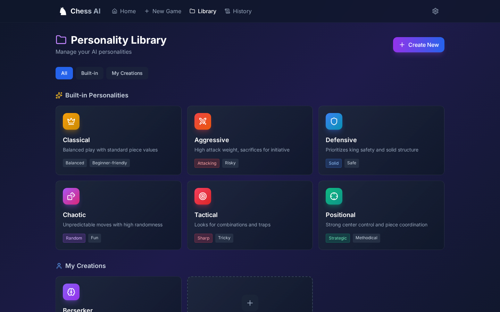
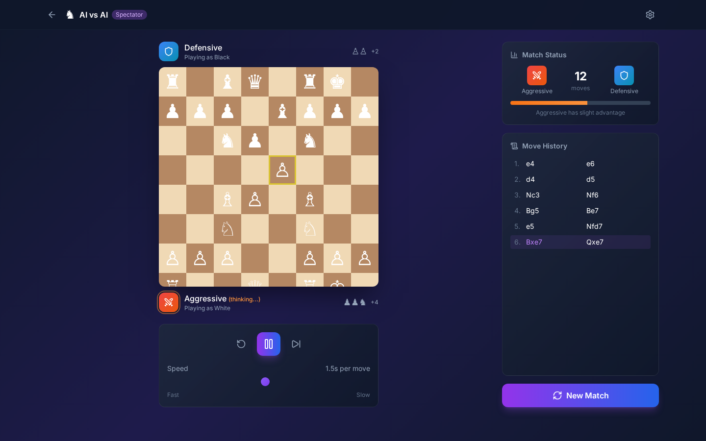
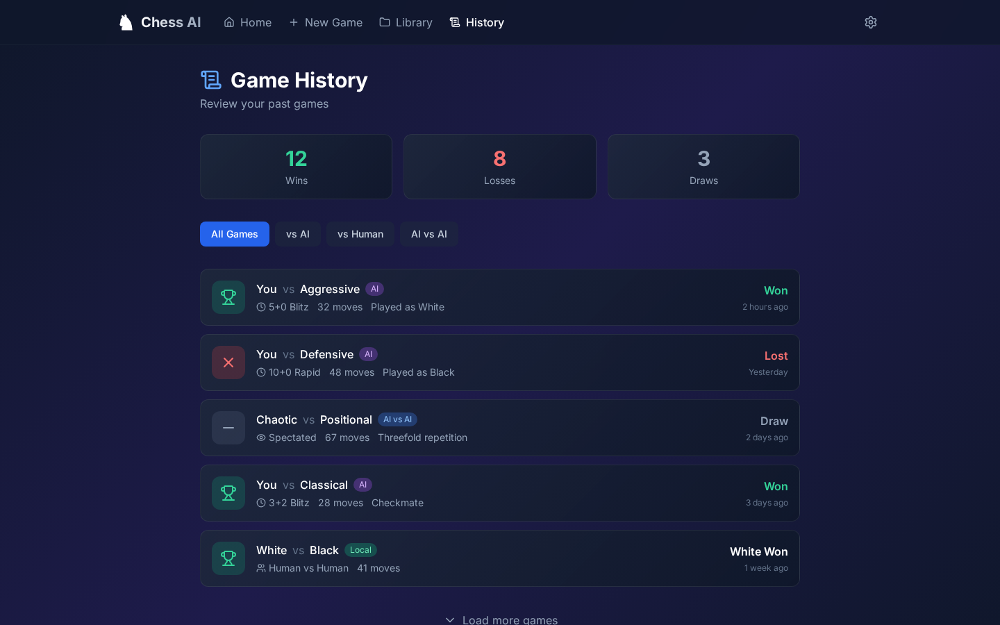
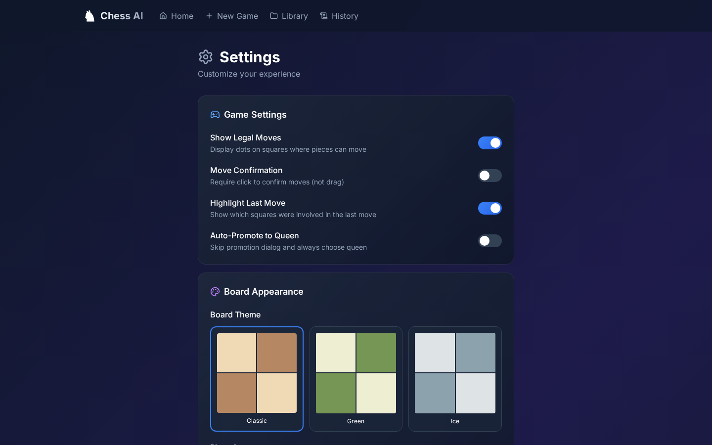
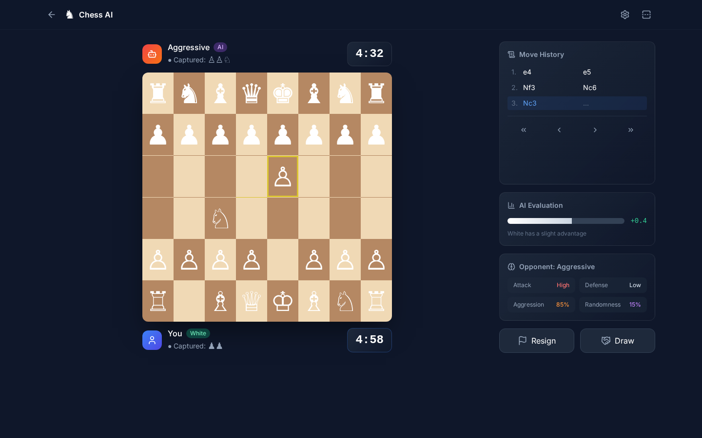
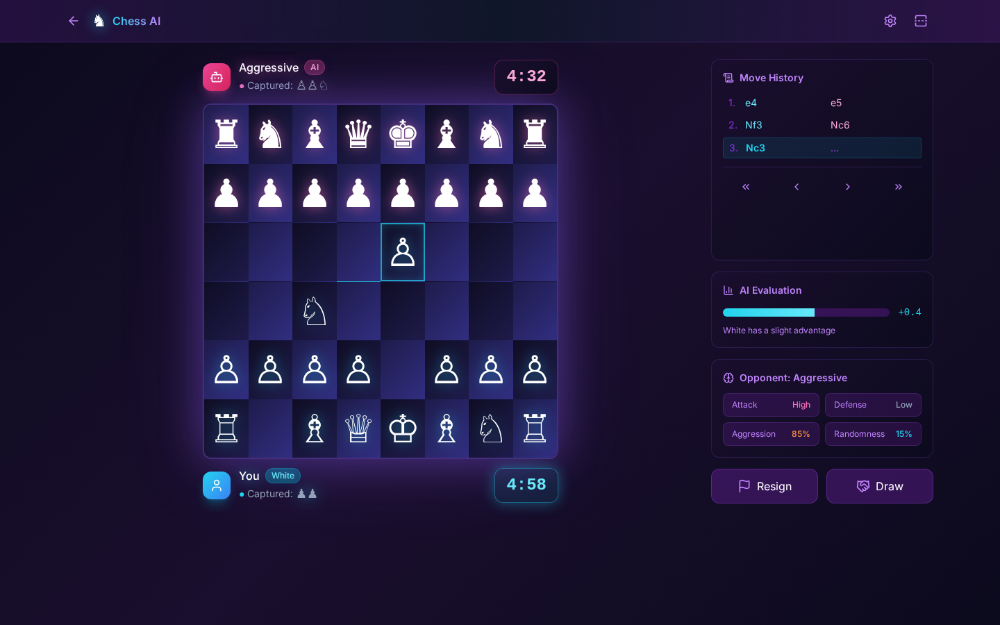
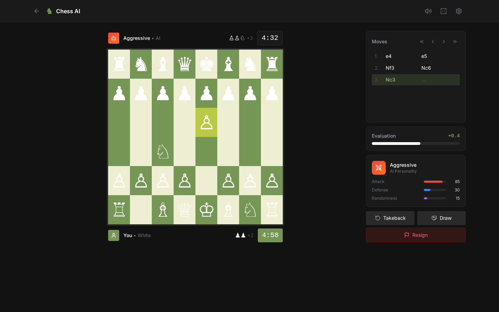

# Chess AI — Design v3

Visual design mockups with full page flow and 3 hero page variants.

## Visual Style

- **Dark theme** with deep slate backgrounds and subtle purple gradient
- **Glass morphism** cards with blur and subtle borders
- **Lucide icons** throughout (no emojis)
- **Gradient accents** for interactive elements
- **Mobile responsive** with bottom tab navigation

## Page Flow (8 Screens)

| Page | Screenshot | Description |
|------|------------|-------------|
| Home |  | Landing page with quick actions, featured personalities, recent games |
| New Game |  | Mode selection, time controls, AI personality picker |
| AI Editor |  | Full personality editor with tooltips on every slider |
| Library |  | Grid view of all personalities (built-in + custom) |
| AI vs AI |  | Spectator mode with playback controls |
| History |  | Game history with stats and filters |
| Settings |  | All preferences: game, appearance, sound, AI, data |

## Hero Page — 3 Visual Directions

The game board is the hero page (most time spent here). Three distinct visual directions:

### Option A: Classic (Lichess-inspired)

- Traditional wood board (brown/cream squares)
- Clean, professional aesthetic
- Focus on gameplay
- Familiar to chess players

### Option B: Neon (Cyberpunk)

- Deep purple gradients with cyan/pink neon glow
- Futuristic, high-tech feel
- Pieces have colored drop shadows
- Board has subtle glow effect
- Appeals to younger/gaming audience

### Option C: Minimal (Chess.com-inspired)

- Green/cream board (Chess.com style)
- Ultra-clean, minimal chrome
- Compact sidebar with progress bars
- Pure black background
- Most professional/corporate feel

## Key Design Decisions

1. **Tooltips everywhere** — Every AI editor control has an info icon with explanation
2. **Gradient icons** — Category icons use gradient backgrounds matching their theme color
3. **Mobile-first nav** — Bottom tab bar on mobile, top nav on desktop
4. **Glass cards** — Subtle blur and gradient backgrounds for depth
5. **Active states** — Clear visual feedback for selections (glowing borders, gradients)

## Files

- `00-design-system.md` — Colors, typography, components
- `01-home.html` / `.png` — Home page
- `02-new-game.html` / `.png` — New game setup
- `03-game-board-*.html` / `.png` — 3 hero page variants
- `04-ai-editor.html` / `.png` — AI personality editor
- `05-library.html` / `.png` — Personality library
- `06-ai-vs-ai.html` / `.png` — AI vs AI spectator mode
- `07-history.html` / `.png` — Game history
- `08-settings.html` / `.png` — Settings page
